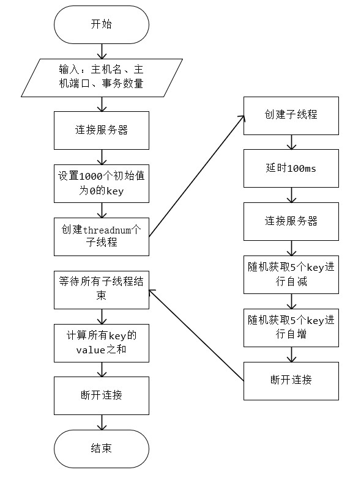

# PingCAP homework

## 问题描述

Transaction 调度器

KV store 里有 1000 个 Key，只有 Put / Get / Delete 接口，KV store 是线程安全的。随机选择 10 个 key 做为事务的 key，Get 这 10 个 key 的 value, Sleep 100 毫秒，把其中 5 个 key 的 value 减 1，并把另外 5 个 key 的 value 加 1，Put 到 KV Store。当所有事务执行停止的时候，要保证所有 value 之和是 0。

实现一个调度器，在并发数不限的条件下，让每分钟执行最多的事务。需要完成可以运行的代码。

## 运行平台及相关工具参数

华为云服务器：CentOS 7.5 64bit 2vCPUs 4GB 40GB

redis版本：5.0.8

hiredis版本（redis的C语言客户端）：v1.0.0

## 解决思路

假设store里面所有key初始相加总和为0，由于每个事务对这随机的10个key的总贡献为0，所以所有事务顺利执行完后，所有value之和定为0。所以问题变为：

1. 线程安全，保证并发条件下各事务对key的``“get->change->set”``操作的原子性。

1. 事务回滚，在事务执行阶段发生错误时，能够回滚到事务执行之初状态。

为了追求效率与高并发,并且已知key数量只有1000时，这里使用redis作为kv存储引擎较为合适。

针对问题1，传统做法是采用乐观锁或者悲观锁的形式保证单个变量操作的原子性。然而在这里，悲观锁容易产生``额外资源开销及死锁``问题（如两事务一个先获取keya再获取keyb，另一个则相反）；乐观锁的话，因为本题存在高并发问题，所以容易产生``循环时间开销大、ABA``问题。

这里便体现出使用redis的优势了。Redis的多线程部分只是用来处理网络数据的读写和协议解析，执行命令仍然是单线程顺序执行，所以天然各命令本身具有原子性。然而，``get``和``set``仍是两条命令，原子性难以保证。不过幸好redis支持``INCR、DECR``能原子性地对key进行自增、自减操作，所以线程安全问题终得以解决。

针对问题2（``由于时间、机器性能、自身能力因素，暂未实现``），可以通过实现undo log, undo log不是顺序记录事务已执行的命令，而是记录每条命令的逻辑相反命令，如事务执行自增那undo log则记录一条自减的操作。当事务意外中断时，将记录的undo log作为一个新的事务线程加入执行。

程序执行流程图：



## 如何运行


```bash
#编译redis
cd redis-5.0.8
make
sudo make install

#编译hiredis
cd ../hiredis-1.0.0
make
sudo make install

#解决“error while loading shared libraries: libhiredis.so.0.10: cannot open shared object file: No such file or directory”问题
sudo ldconfig

#编译主程序
cd ..
gcc main.c -o main -I /usr/local/include/hiredis -lhiredis -lpthread -std=c99

#修改redis.conf里的maxclients,默认只能连接10000个客户端，这里自己已修改为1000000

#启动redis服务器
cd redis-5.0.8
nohup redis-server redis.conf &

#运行程序,线程数自己设定，这里设定10000
cd ..
./main 127.0.0.1 6379 10000
```
